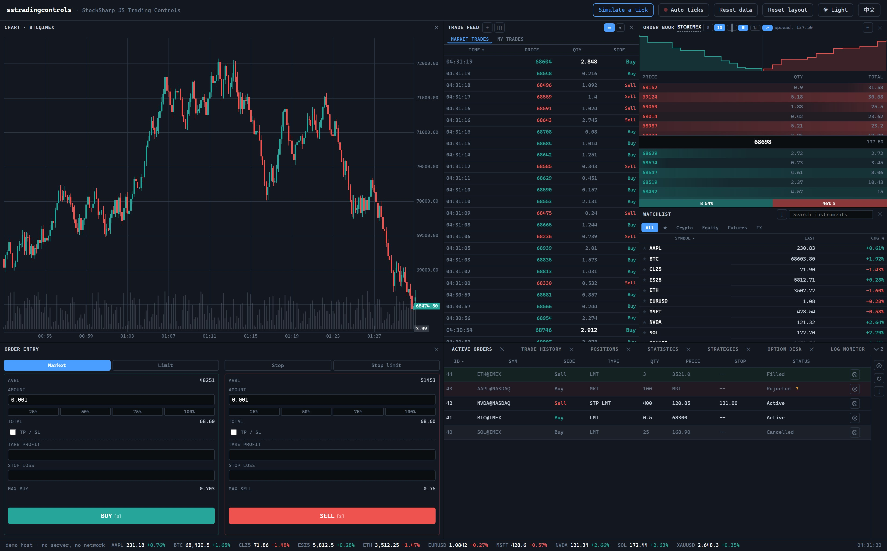
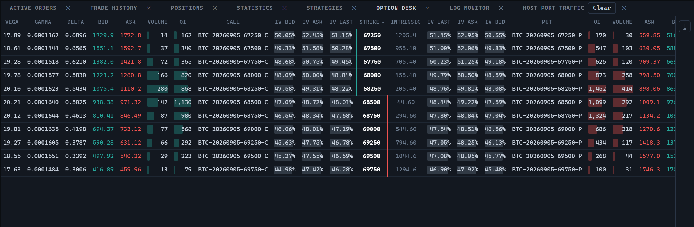

# StockSharp JS Trading Controls

[](https://github.com/StockSharp/JS-TradingControls/actions/workflows/ci.yml)
[](https://www.npmjs.com/package/@stocksharp/trading-controls)
[](LICENSE)

**StockSharp JS Trading Controls** are the browser panels a trading screen is made
of. Eleven of them: the **active orders**, **positions** and **trade history**
blotters, a **watchlist** with live quotes and category tabs, an **order entry**
pad, a **trade feed**, an **order book** ladder, a **statistics** table, a
**strategies** dashboard, a **log monitor**, and an **option desk**.

Each control builds its own DOM, renders its own table through
[`@stocksharp/grids`](https://www.npmjs.com/package/@stocksharp/grids), and reaches
the outside world through exactly one object — a `TradingHost`.

[Live demo](https://stocksharp.github.io/JS-TradingControls/demo/) ·
[StockSharp website](https://stocksharp.com/) ·
[GitHub repository](https://github.com/StockSharp/JS-TradingControls) ·
[Issue tracker](https://github.com/StockSharp/JS-TradingControls/issues)



The page above is `demo/` — the published bundle over a demo `TradingHost`, no
server and no network, laid out by the same dockview-core the StockSharp web
terminal uses, with an [`@stocksharp/chart`](https://www.npmjs.com/package/@stocksharp/chart)
candlestick panel fed by the same simulated prices. The **Host port traffic**
tab records every call the controls made into that host, which is the whole of
what they can reach.

## Quick start

```sh
npm install @stocksharp/trading-controls
```

```ts
import { PositionsWidget } from '@stocksharp/trading-controls';
import '@stocksharp/trading-controls/styles.css';
// Optional: a working dark/light palette, if your page has none of its own.
import '@stocksharp/trading-controls/theme.css';

const panel = PositionsWidget.create(document.querySelector('#positions')!, {}, {
  host,                                        // see "The host port" below
  closePosition: (pf, instrument, symbol) => api.close(pf, instrument),
  reversePosition: (pf, instrument, symbol) => api.reverse(pf, instrument),
  refreshPositions: () => reload(),
});

panel.update(positions);
panel.updateBalance({ available: 1000, locked: 250, total: 1250 });
```

The package also ships a ready-to-use browser bundle exposed as
`window.SSTradingControls`:

```html
<script src="https://cdn.jsdelivr.net/npm/@stocksharp/trading-controls@1.0.0/dist/sstradingcontrols.js"></script>
<script>
  const { PositionsWidget } = window.SSTradingControls;
</script>
```

## The host port is the whole API surface

A control imports no translator, no settings singleton, no panel registry and no
docking manager, and it never reads a `window` global. Everything it needs
arrives as one `TradingHost`:

| member | what the host answers |
|---|---|
| `isPrimary` | is this the instance that speaks for the page? |
| `t(key, …args)` | translate; see [Text](#everything-a-control-shows-is-the-hosts) for what a key looks like |
| `presentation` | word and colour a side, an order type, a status, a P&L sign |
| `preferences` / `cache` | two stores — settings that must survive, and scratch |
| `trading` | the API, the market-data client, the active portfolio, an instrument picker |
| `ticker` | where a control reports the symbols it is showing |
| `allow(action)` | may the user do this? |
| `log(message)` | where diagnostics go |
| `close()` `spawn(state)` `persistState(patch)` `saveLayout()` | lifecycle calls back |
| `register` `unregister` `broadcast<T>` | the host's handle on live instances |

**Every member is required, and `assertHost` proves it before the control
renders anything.** A half-supplied host is how a control half-works: it draws,
it looks alive, and the one capability nobody wired is discovered by a user
clicking something that does nothing. So a missing member throws at construction
naming the path — `WatchlistWidget: host.trading.api.getExecutions is required` —
nested members included.

**Every member is now reached by some shipped control.** When four of them were
here the port was already this wide, and the seven members nothing yet called —
`spawn`, `persistState`, `saveLayout`, `log`, `trading.pickInstrument`,
`marketData.resubscribe`, `marketData.getOrders` — were required anyway, because
the controls still on the terminal's side of the boundary were written against
this same interface and called them. Those controls have since moved in and do
call them, which is the argument for not having narrowed the port and widened it
again seven times.

A host adopting a subset still has to answer for all of it. Stubs are a correct
answer where a capability genuinely does not exist on that page: a no-op `spawn`,
a `log` that forwards to the console.

Two pairs are deliberately separate rather than merged:

- **`preferences` and `cache` are two stores.** The watchlist's per-symbol,
  per-day price baseline is scratch. Routing it through a server-synced settings
  blob is how a settings row becomes a cache.
- **`persistState` and `saveLayout` are two calls.** One records into the panel's
  bag, the other flushes. Hiding a disk write inside "remember this" is exactly
  the invisible coupling the port exists to remove.

## Everything a control shows is the host's

- **Text** arrives through `t()`. There is no dictionary here and no string the
  package decides the wording of — see below for the keys you have to answer.
- **Colour** is class names the control emits; `styles/trading-controls.css`
  gives them meaning and reads its values from `--t-*` custom properties. Four
  names go the other way: `presentation.sideClass` and `pnlClass` are the
  *host's* answer, and a control forwards the string to the cell without
  looking at it. The shipped stylesheet paints `side-buy` / `side-sell` and
  `pnl-positive` / `pnl-negative`; answer with those, or answer with your own
  names and style those yourself. The port exports the list as
  `PRESENTATION_CLASSES`, and `npm test` asserts the stylesheet styles all four.
- **Data** is handed in. A control never fetches on its own — except the two
  reads the port names (`getExecutions`, `searchInstruments`), which the host
  implements.

### The 222 keys a host has to answer

`t()` cannot fail. A key the host does not know is rendered to the user as
itself, so `NoActiveOrders` appears in the empty blotter and `ClosePanel`
becomes a tooltip — a missing translation looks like a typo, never like an
error. The complete list ships with the package:

```ts
import keys from '@stocksharp/trading-controls/translation-keys.json';
// { count: 222, keys: ['Actions', 'ActiveOrders', …] }
```

It is **generated from the sources** (`npm run i18n:update`) and re-checked by
`npm test`, so it cannot drift from what the controls actually ask for. Because it
is generated by scanning for `t('literal')`, no control may assemble a key from a
value: a computed key would be invisible to the scan, absent from the list, and
would reach a user as itself. A test renders each control over data that takes
every branch of its wording and asserts that everything it asked for is on the
list.

One set of keys is deliberately not: the trading modes a host hands
`StrategiesWidget`. The host says what a run may be put in and therefore words
them, so those strings are its vocabulary and answering for them is its job.

The keys are not derivable, which is why the list is shipped rather than
described. Most are resource identifiers (`ClosePanel`, `ExportToExcel`,
`NoActiveOrders`, `Change24hPct`); some are English phrases, because that is the
form the terminal's dictionary already held them in (`Close position on {0}`,
`No trade history`, `Locked: ${0}`). `{0}`, `{1}` … are replaced positionally
from the `args` of the same `t()` call, so a translation may reorder them.

Controls render elements, never HTML strings, so nothing here can be an
injection site. A cell that holds a button holds a real element with its own
listener rather than an `onclick` attribute reaching a global.

## The stylesheet contract

The package **ships its stylesheet** — `@stocksharp/trading-controls/styles.css`.
Documenting the class names instead would have left an adopting page to
re-author about six hundred lines of CSS before it could see a table, which is
not "renders outside its original host" in any useful sense.

It is split in two so a host does not have to take a palette it disagrees with:

| file | what it is | when to import |
|---|---|---|
| `@stocksharp/trading-controls/styles.css` | every rule, reading `var(--t-*)` and declaring none | always |
| `@stocksharp/trading-controls/theme.css` | a working dark + light palette (`:root`, and `:root[data-bs-theme="light"]`) | only if your page has no `--t-*` tokens of its own |

**The 28 properties a host must supply** if it skips `theme.css`:

| group | properties |
|---|---|
| surfaces | `--t-bg` `--t-panel` `--t-header` `--t-hover` `--t-border` |
| text | `--t-text` `--t-text-dim` `--t-text-bright` |
| accent | `--t-accent` `--t-accent-hover` `--t-accent-text` `--t-accent-glow-soft` |
| direction | `--t-green` `--t-red` `--t-green-flash` `--t-red-flash` |
| warning | `--t-orange` (destructive but not a cancel) `--t-warning` (read this) |
| type and shape | `--t-font` `--t-mono` `--t-radius` `--t-transition` |
| measured slots | `--t-ob-bar` `--t-ob-heat` `--t-ob-sent` |

The measured slots are the odd group: they are not colours a host picks but
numbers a control writes. An order-book level's volume bar is a share of the
largest level beside it and its tint a share of the direction colour, both
measured per frame from the data — so the control sets them on the element it
just built and the rules read them back, which keeps the widths and the colours
in CSS. The declarations in `theme.css` are the "nothing measured yet" defaults;
a host declaring its own palette can leave them out, because every painted
element carries its own.

All are required — none of them has a fallback baked into the rule that
reads it. A `var(--t-orange, #f0b90b)` would keep the rule working on a host
that never declared the token, which means the host never finds out, and the
control quietly paints a shade from a palette nobody chose. `--t-orange` and
`--t-warning` were the two that did, and no longer do.

`npm test` runs `tools/check-style-contract.mjs`, which fails if a control emits
a class the stylesheet never styles, if the stylesheet misses one of the
`PRESENTATION_CLASSES` the host may return, if a rule reads a property
`theme.css` does not declare, if `theme.css` declares one no rule reads, or if
any rule reads a property with a fallback. The contract above is therefore
checked, not just written down.

Two things the page still owns:

- **Bootstrap Icons.** A control says which glyph a button wears (`bi bi-x`,
  `bi bi-arrow-clockwise`) but does not draw it, exactly as it names a colour
  token without defining it.
- **`grid-empty`, `visually-hidden`, `sort-asc` / `sort-desc`** come out of
  `@stocksharp/grids`. This stylesheet carries them so an adopting page does not
  have to know that; the second is spelled the way Bootstrap spells it.

## What each control is

### `ActiveOrdersWidget`

The session's whole order list — nothing drops out on its own, so a user can
watch an order's transitions instead of having a row vanish. A terminal row is
greyed; a rejected one carries its reason on a hover icon (unwrapped out of the
venue's JSON blob when it arrives that way) and its × dismisses locally rather
than sending a cancel with nothing to cancel. Quantity, price and stop are
editable in place while the venue still holds the order; committing an edit
restates the whole triple, because a replace is not a field patch.

### `PositionsWidget`

Alphabetical at rest — positions have no natural "newest". Cash sits above them
as a pinned row: a different shape from a position, so it supplies its own cells,
stays out of the sort and out of the exported sheet, and being content it
suppresses the "no positions" row. Close and reverse are per-row buttons wired to
deps.

### `TradeHistoryWidget`

Read-only, newest fill on top, loaded against whichever portfolio the host names
at refresh time rather than one captured at construction.

### `WatchlistWidget`

Live quotes with a search box, favourites and one tab per instrument category
found in the data. A quote patches the two affected cells through the grid's
`(rowKey, columnKey)` lookup instead of repainting — a repaint would cancel the
flash animation it just started. It paints a screenful (`RENDER_CAP`) while the
export and the subscription sync work over the whole filtered set, and only the
primary instance reports to the host's ticker.

### `OrderEntryWidget`

A split Buy/Sell pad over one order-type selector: market, limit, stop and stop
limit, each showing only the price fields it uses. It renders no table — the one
control here that does not use the grid — and it holds no data source: reference
prices (`setLimitPrice`, `setBbo`), the venue's size and price grid
(`setInstrument`) and the balance figures its percent buttons divide
(`setAvailable`, `setMaxQuantity`) are all pushed in.

Sending is not its half. `TradingApi` is read-only, and the sign-in gate, the
connection check and the choice of portfolio are the host's, so the pad validates
against the instrument's grid, collects the column and hands both to the required
`submitOrder` dep. A form the venue would reject never gets that far: the reason
takes over the estimate line and the button goes dead.

Everything a host used to reach into it for is a method — `setOrderType`,
`setPrice`, `setQuantity`, `getInstrument`, `preselect` for the side a
click-to-trade gesture aimed at, `setEnabled` for a socket that dropped.

### `TradeFeedWidget`

The public tape, in one of two renderings the page shares through the preference
store: a row per print, or a bubble chart of the same prints — time across,
price up, volume as the radius, direction as the colour. Prints are pushed in
(`setTrades`, `addTrade`) because a host fans one socket to every live feed; a
feed accepts only the symbols it watches, so per-instance pinned extras work
without a second subscription. Pinning one adds a lane to the chart with its own
price scale, so a $76k symbol and a $270 one stay legible side by side.

The chart is the one thing here drawn rather than styled, and a canvas takes no
class names — so its geometry is computed as numbers (`layoutBubbles`,
`aggregateBubbles`, both exported and both covered without a canvas in sight)
and its colours come from `presentation.canvasPalette()`. Nothing in it is
painted from a palette this package chose.

The second tab is the account's own fills, and the only thing this control pulls
rather than being handed: it asks `trading.api.getExecutions` for the portfolio
the host names at the moment the tab is opened.

### `OrderBookWidget`

The ladder, in one of two layouts and either side order, each remembered — page
wide for the instance that follows the host's symbol, per panel for a pinned one.
Levels are pushed in as `applyFrame`: a snapshot replaces the book, the diffs
after it carry a per-symbol sequence, and a break in that sequence makes the
ladder ask `marketData.resubscribe` for a fresh snapshot rather than apply a diff
to a book it can no longer trust. Everything it refuses on the way in — a level
with no price, a negative size, a delete for a level it never had, a crossed book
— goes to `host.log`, because none of it is visible to the user and all of it
matters to support.

A click reports the level and the side the user would trade (`onPriceSelected`);
ctrl-click is the same gesture with intent to send (`onPriceExecuted`). Neither
sends anything itself. The levels this session has size resting on are badged
from `marketData.getOrders()`, which is a read of what the host already holds
rather than a second subscription.

Two measurements arrive as deps rather than being read off `window`: `maxDepth()`
— how many levels this page has room for, which is how a phone gets five instead
of ten — and `pixelRatio()` for the depth chart's backing store. The chart itself
is drawn, so its geometry is arithmetic (`orderbook-depth.ts`, covered without a
canvas) and its colours come from `presentation.canvasPalette()`. Everything else
is class names: the volume bar's share of its side and the heat behind a level
reach the stylesheet as measured custom properties (`--t-ob-bar`, `--t-ob-heat`,
`--t-ob-sent`), so no width and no colour is decided in TypeScript.

### `StatisticsWidget`

What a run made, one parameter per row, grouped by category and left in the order
the host sent them — the registry's order, which puts profit before trades before
positions before orders, and is not alphabetical. The panel measures nothing: a
statistic is produced by whatever ran the strategy, so the whole set arrives at
once through `update` and a row that stopped being sent has stopped existing.
There are no deps beyond the host, because there is nothing on the table to act
on. A value is a number, a moment or nothing at all, and nothing is a blank cell
rather than a zero: a figure that has not been measured yet is not a measured
zero.


### `StrategiesWidget`

A row per run: its state, whether it is online, the mode it trades in, its
instrument, position, order and trade counts, what it has made, and a sparkline of
how it got there. Every action is a dep and a row only offers what the host can
carry out — start appears on a stopped run and stop on a started one, the
trading-mode cell is a plain caption unless `setTradingMode` was supplied. The
modes themselves come from the host and are worded through `t()`, which makes them
the one set of keys in this package that the host answers for rather than the
shipped list.

The sparkline is a canvas sized in device pixels and drawn from
`presentation.canvasPalette()`, so it is as sharp as the text beside it and green
and red mean there what they mean everywhere else on the page.


### `LogMonitorWidget`

A source tree beside the messages, which is how a log with more than one writer is
read: pick a node and the table shows that source and everything under it. Sources
arrive whole through `setSources` and messages accumulate through `append`, capped
(`maxMessages`, five thousand by default) so a session left running overnight
cannot grow without bound. The five levels toggle independently and the filter is
a substring over the message and its source together.

A message names its source by id; what that id is *called* comes from the tree, so
renaming a source — or switching the page's language — re-captions the messages
that were already in the table.


### `OptionDeskWidget`

One expiry of a chain, the call side mirrored against the put side around the
strike. Volume and open interest are scaled per side, because calls and puts trade
in different sizes and comparing one against the busiest of the other says
nothing; volatility is scaled across both at once, because a skew is exactly the
comparison between them.

Greeks arrive one of two ways and the desk does not care which: a host that prices
its own sends them on the contract, and a host that has quotes and an expiry sends
the volatility instead and the desk prices delta through rho itself, from the
Black-Scholes that ships with the package (`premium`, `greeks`,
`impliedVolatility` — exported, because a host that wants the arithmetic without
the table should not have to reimplement it). The number of decimal places in a
greek column comes from the numbers in it: gamma on an underlying at sixty
thousand is about 0.00003, and the four places that suit a delta would show every
strike as nothing.



## Exported sheets say what the screen says

Every blotter exports to `.xlsx` through the grid, and a column states both
forms: the localized text the user reads (`Sell`, `Filled`) and the raw figure
under it (`2000` rather than the formatted `2,000.00`), so a sheet is sortable as
numbers and cannot drift from the table it came from.

## Development

```sh
npm install
npm test     # typecheck + public-API snapshot + style contract + unit tests
npm run build
```

`dist/` and `tests/_dist/` are build outputs and are gitignored.

There is no browser in the test process: `tests/fake-dom.ts` implements the slice
of DOM the controls touch, and its size is the statement of how narrow that
slice is.
